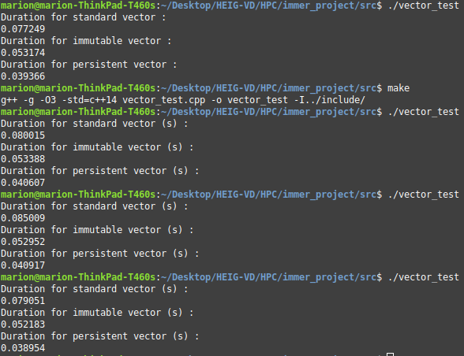

# HPC - Projet 2 : Analyse de l'outil immer

Auteur : Marion Dutu Launay

Date : 12 juin 2020

## Description du logiciel

Immer est une bibliothèque écrite en C++ qui propose des structures de données persistantes, c'est à dire qui préserve ses versions précédentes lorsqu'elle est modifiée. Une telle structure est immuable, en d'autre termes son état ne peut pas être modifié après sa création. ; en effet, ses opérations ne la modifient pas de manière visible mais renvoient de nouvelles structures.

Cette librairie tire parti des fonctionnalités du standard C++ récent afin de fournir une API efficace et naturelle pour un développeur lambda. Elle implémente des structures de données "de pointe" en utilisant efficacement le cache et inclut des améliorations particulières par rapport à celles qui sont possibles en raison de la capacité du C++ à abstraire l'organisation de la mémoire. Immer exploite des modèles et un design basés sur des politiques permettant de créer des structures de données qui peuvent être adaptées pour fonctionner efficacement à diverses fins et architectures.

## Motivations

La conférence du créateur de Immer explique ses réflexions quant aux limites et problèmes des structures de données basiques et du modèle de programmation standard (7 premières minutes) : https://www.youtube.com/watch?v=sPhpelUfu8Q

Au cours des dernières années, un intérêt croissant pour les structures de données immuables est apparu, motivé par l'escalade de notre puissance de traitement et l'omniprésence des systèmes hautement interactifs.

Ce type de structures permet d'obtenir d'innovants types d'architecture pour des programmes interactifs et concurrents d'une simplicité, exactitude et performance remarquables.

Le passage par valeur des structures de données immuables n'a pas besoin de copier des données. En l'absence de mutation, les données peuvent être lues sans risque depuis plusieurs processus simultanés et activer des modèles de concurrence comme le partage, avec une communication efficace.

## Procédure d'installation

Immer est une librairie contenue dans fichier header uniquement. Pour l'utiliser, il faut télécharger le dossier `immer` du dépôt GitHub (lien dans les sources) et effectuer la procédure standard d'inclusion d'une librairie externe.

Dans mon cas, j'ai mis le dossier `immer` dans le dossier `include` dans mon projet et compilé mes fichiers source avec l'option `-I../include/`.

Pour l'utiliser dans un code, il suffit simplement d'inclure le fichier d'entête que nous souhaitons utiliser de façon standard.

## Etude d'un use case

### Remarque préalable

Les use cases des structures de données immuables sont nombreux, mais les plus pertinents sont ceux qui demandent beaucoup de code et de réflexion ; le développeur de la librairie immer a écrit tout un éditeur de texte avec des structures de données provenant de sa librairie qui prouve l'efficacité de cette dernière. Par exemple, il peut effectuer des retours en arrière (Ctrl+Z) très rapidement même après avoir introduit beaucoup de texte car l'état actuel du texte est stocké dans une structure immuable.

Pour ma part, je n'ai pas trouvé de use case très pertinent, j'ai donc effectué une comparaison entre un vecteur standard de type `vector` et son équivalent dans la librairie immer.

### Mon exemple d'utilisation

(voir code en annexe)

Dans mon travail, je me suis intéressée à la structure `immer::vector` et `immer::vector_transient`. Le premier est un vecteur immuable et le second est transitoire : il sert à effectuer des opérations avec comme objet de départ un vecteur immuable. En interne, il utilise donc des structures immuables. Au terme des opérations, on peut récupérer un objet immuable depuis ce type de vecteur transitoire.

Le code d'implémentation instancie 2 vecteurs : un vecteur de `string` standard et un vecteur de `string` immuable. Il y a deux fonctions qui effectuent la même chose : les vecteurs sont remplis avec les données d'un fichier de 8.1 MB qui contient l'ensemble des mots du dictionnaire anglais. Un timer interne permet de mesurer le temps d'exécution de l'opération de remplissage, qui s'effectue avec des `push_back`. Ce timer nous donne une précision relativement suffisante pour notre mesure et le résultat final est affiché en secondes.

Comme on ne peut pas faire de `push_back` directement sur le vecteur immuable, il faut passer par la fonction `move()` pour que cela soit valide. Des performances similaires, même meilleures, sont obtenues avec l'utilisation d'un vecteur transitoire comme l'implémente la troisième fonction.

En comparant, le pire temps de remplissage semble être celui du vecteur standard, et le meilleur est celui utilisant le vecteur transitoire qui prend environ 0.4 secondes de moins :

Cela prouve que l'utilisation de structures immuables est très bénéfique.

## Conclusion

## Matériel de référence

- Code annexe (Makefile + code source)
- Librairie immer
- Fichier dictionary.txt

Mon processeur est un Intel Core i5-6300U

## Sources

Documentation officielle : https://sinusoid.es/immer/

Code source immer : https://github.com/arximboldi/immer
